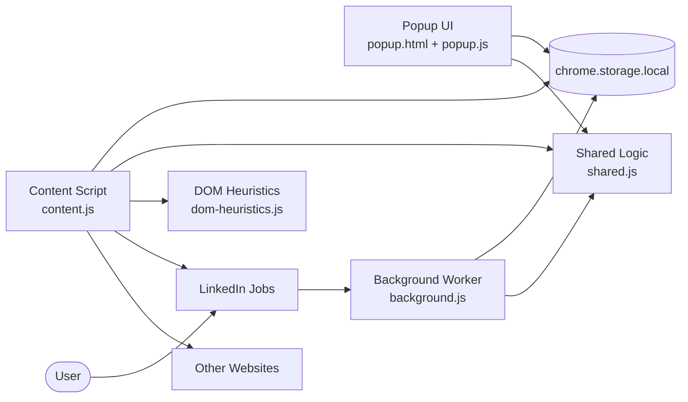

<h1 align="center">Job Search Lens</h1>

<p align="center">
  Local-only Chrome extension that highlights keywords on any job site and adds LinkedIn-specific tools for dimming and company stats.
</p>

<p align="center">
  
  
  
  
  
</p>

<p align="center">
  <a href="#overview">Overview</a> ·
  <a href="#features">Features</a> ·
  <a href="#installation">Installation</a> ·
  <a href="#permissions">Permissions</a> ·
  <a href="#privacy">Privacy</a> ·
  <a href="#publishing-resources">Publishing Resources</a>
</p>

---

## Overview

Job Search Lens makes job pages easier to scan without sending any browsing data to a backend.

It does three things:

1. Highlights saved keywords on any website where the extension runs — LinkedIn, Indeed, Seek, Glassdoor, company career pages, or anywhere else.
2. Passively dims job cards LinkedIn already labels as Viewed, Saved, or Applied.
3. Shows company size and LinkedIn employee counts inline near job titles on LinkedIn, so you can judge company fit without opening a separate tab.

All settings stay local in the browser through `chrome.storage.local`.

## Features

**Works on any website**
- Highlight custom keywords anywhere the extension runs — job boards, company career pages, aggregators.
- Save keywords from selected text by right-clicking on any page.
- Assign a color to each keyword with an inline palette.
- Search, sort, and export the keyword library.
- Navigate between matches with previous and next controls.
- Switch between Auto, Light, and Dark popup themes.

**LinkedIn Jobs extras**
- Dim Viewed, Saved, and Applied job cards independently.
- Inline company size and LinkedIn employee count next to job titles — no extra tab needed.
- Handles LinkedIn SPA route changes and multiple results-list layouts including the newer SDUI page variant.

## Installation

### Local setup

```bash
git clone https://github.com/MadhushanAndawaththa/Job_Search.git
cd Job_Search
npm install
npm test
```

### Load the extension in Chrome

1. Open `chrome://extensions`.
2. Enable Developer mode.
3. Click Load unpacked.
4. Select this repository folder.
5. Open `https://www.linkedin.com/jobs/` to use the full LinkedIn workflow.
6. If you also want keyword highlights on non-LinkedIn pages, turn on `Highlight on all websites` in the popup once.

## Permissions

The extension keeps its permission surface intentionally small.

| Permission | Why it is needed |
|---|---|
| `contextMenus` | Adds the selection-based “Add to Highlighter” action on webpages. |
| `storage` | Stores keywords, colors, and dim-state settings locally. |
| `activeTab` | Lets the popup identify the active tab and ask the content script for status and match navigation when the user opens the popup. |
| `permissions` | Lets the popup request or remove optional all-site access when the user toggles cross-site highlighting. |
| `scripting` | Registers and injects the optional non-LinkedIn page helper after the user enables all-site highlighting. |
| `https://www.linkedin.com/*` host access | Lets LinkedIn Jobs dimming, company stats, and keyword highlighting run automatically on LinkedIn. |
| `http://*/*` and `https://*/*` optional host access | Requested only if the user turns on `Highlight on all websites`, so keyword highlights can run automatically on non-LinkedIn pages. |

## Privacy

Job Search Lens is designed to be publishable under a conservative, local-only privacy model.

- No telemetry
- No analytics
- No external API calls
- No remote code
- No user accounts
- No cloud sync
- No sale or sharing of personal data

The extension reads page content locally to highlight your saved terms. On LinkedIn Jobs, it also detects LinkedIn’s own Viewed, Saved, and Applied labels already rendered on the page. On non-LinkedIn sites, it only reads page text after the user enables optional all-site access from the popup. That processing stays local to the browser.

For a store-ready policy document, see [docs/privacy-policy.html](docs/privacy-policy.html).

## Architecture



## Testing

Automated coverage currently includes 31 passing tests across shared helpers, DOM heuristics, and scenario content-script regressions.

```bash
npm test
```

Current coverage includes:

- keyword normalization and deduplication
- hex color validation and contrast selection
- keyword insert, remove, and recolor flows
- literal regex generation for special-character terms
- LinkedIn job ID extraction
- settings sanitization
- scenario-based results-list detection heuristics
- visual wrapper promotion for LinkedIn card variants
- company stats extraction and insertion for classic, SDUI, and wrapped-title LinkedIn layouts
- generic keyword highlighting on non-LinkedIn websites without any LinkedIn-specific mutations

## Publishing Resources

The public product site is at **[madhushanandawaththa.github.io/Job_Search](https://madhushanandawaththa.github.io/Job_Search/)**
(served from the `docs/` folder via GitHub Pages).

This repo also includes the assets and reference material needed for store preparation:

- [docs/index.html](docs/index.html): product landing page
- [docs/privacy-policy.html](docs/privacy-policy.html): privacy policy — [live link](https://madhushanandawaththa.github.io/Job_Search/privacy-policy.html)
- [docs/support.html](docs/support.html): support page — [live link](https://madhushanandawaththa.github.io/Job_Search/support.html)
- [docs/chrome-web-store-submission.txt](docs/chrome-web-store-submission.txt): listing copy, permission justifications, and publish checklist
- `assets/icons/`: manifest and store icon files (16 / 32 / 48 / 128 px)
- `assets/store/`: branded promo tiles and listing graphics
- `tools/generate-assets.ps1`: repeatable PowerShell script to regenerate all store graphics

## Project Structure

```text
Job_Search/
├── assets/
│   ├── icons/                  # Manifest and store icons
│   └── store/                  # Promo tiles and listing graphics
├── background.js              # Context menu capture and local keyword storage
├── content.js                 # Cross-site highlight orchestration and LinkedIn-specific dim/stats features
├── dom-heuristics.js          # Scenario-safe list/card detection helpers
├── docs/
│   ├── index.html             # Homepage-style landing page
│   ├── privacy-policy.html    # Privacy policy page
│   ├── support.html           # Support page
│   └── chrome-web-store-submission.txt
├── manifest.json              # Chrome extension manifest
├── popup.html                 # Popup UI markup and styling
├── popup.js                   # Popup logic and active-tab diagnostics
├── shared.js                  # Shared logic used across runtime surfaces
├── styles.css                 # Highlight and dim styling injected into pages
├── tests/
│   ├── dom-heuristics.test.js
│   ├── fixtures/
│   └── shared.test.js
├── theme-init.js              # Early theme bootstrap for no-flash popup rendering
├── tools/
│   └── generate-assets.ps1    # Rebuilds icons and store graphics
├── package.json
└── .gitignore
```

## License

This project is released under the **MIT License + Commons Clause**.

You are free to use, study, modify, and share the code for personal or educational purposes.
Selling, charging for access to, or building a paid product from this code is not permitted.

See [LICENSE](LICENSE) for the full text.

---

## Disclaimer

This project is an independent utility and is not affiliated with or endorsed by LinkedIn.

LinkedIn may change its markup or platform policies at any time, so selector maintenance and careful release review remain necessary.

## Version History

| Version | Summary |
|---|---|
| 1.3.0 | Added optional all-site highlighting from the popup while keeping LinkedIn automatic by default; added inline company size and LinkedIn employee counts near job titles; added SDUI page support (scenario 13); improved title-anchor placement for wrapped-title SDUI layouts (scenario 15); updated popup status messaging |
| 1.2.2 | Renamed the product to Job Search Lens, refreshed docs and store copy, added scenario 6-8 regression coverage, and prepared updated store assets |
| 1.2.1 | Publish-prep metadata, icons, static policy/support pages, scenario 5 heuristics, and DOM fixture tests |
| 1.2.0 | Color palette swatches, keyword export and sort, and multi-list root coverage |
| 1.1.0 | Theme support, Saved and Applied dimming, and SPA-aware observers |
| 1.0.0 | Initial release: keyword highlighting and Viewed-state dimming |