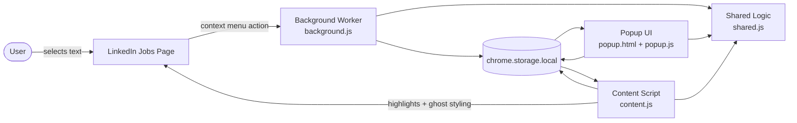

<h1 align="center">Job Hunt Visualizer</h1>

<p align="center">
  Local-first Chrome extension for LinkedIn job search that highlights the titles and keywords you care about and fades jobs you have already viewed.
</p>

<p align="center">
  
  
  
  
  
  
</p>

<p align="center">
  <a href="#quick-start">Quick Start</a> ·
  <a href="#features">Features</a> ·
  <a href="#architecture">Architecture</a> ·
  <a href="#privacy--safety">Privacy & Safety</a> ·
  <a href="#running-tests">Tests</a> ·
  <a href="#project-structure">Project Structure</a>
</p>

---

## Quick Start

> **Prerequisites:** Chrome or Edge (Chromium-based) and Node.js 18+ if you want to run the automated tests.

```bash
git clone https://github.com/MadhushanAndawaththa/Job_Search.git
cd Job_Search
```

### 1. Run the test suite

There are no runtime dependencies to install for the current test setup.

```bash
node --test
```

Or use the package script:

```bash
npm test
```

### 2. Load the extension in Chrome

1. Open `chrome://extensions`
2. Enable **Developer mode**
3. Click **Load unpacked**
4. Select this project folder
5. Open a LinkedIn jobs page and start using the popup or context menu

### 3. Try the main workflows

1. Select a job title or keyword in a LinkedIn job description
2. Right-click and choose **Add "selected text" to Highlighter**
3. Open the popup to change the highlight color or remove the term
4. Click job cards in the results list and watch previously viewed jobs fade out

---

## What It Does

Job Hunt Visualizer is designed to reduce repetitive scanning during LinkedIn job search.

It helps in two simple ways:

1. **Keyword highlighting**: terms you care about such as `Python`, `Staff Engineer`, `Remote`, or `Visa Sponsorship` are highlighted directly inside the LinkedIn job details panel.
2. **Viewed-job ghosting**: once you actually click a job, the extension remembers it locally and fades that card the next time it appears in the results list.

The result is a faster, more organized workflow without needing spreadsheets, external accounts, or scraping infrastructure.

---

## Features

| | Feature | Details |
|---|---------|---------|
| 🎯 | **Select To Highlight** | Right-click selected LinkedIn text and save it as a tracked title or keyword |
| 🎨 | **Per-Keyword Colors** | Give each saved term its own color from the popup |
| 👻 | **Viewed Job Tracker** | Fade jobs you have already opened so you do not keep revisiting the same cards |
| 🪶 | **Passive LinkedIn Integration** | No dashboards or buttons injected into LinkedIn pages |
| 🔁 | **Live Storage Sync** | Popup changes propagate through `chrome.storage.local` without reloading the page |
| ⏸️ | **Pause Toggle** | Temporarily disable highlighting and ghost styling without deleting data |
| 🧩 | **SPA-Aware Content Script** | Handles LinkedIn route changes and dynamic detail pane updates |
| 🔒 | **Local-Only Privacy** | No backend, no analytics, no external API calls, no remote sync |

---

## Architecture



**Runtime flow:**

1. **Capture**: the user selects text on LinkedIn and adds it through the Chrome context menu, or enters it manually in the popup.
2. **Persist**: the extension stores keywords, colors, viewed job IDs, and settings in `chrome.storage.local`.
3. **Observe**: the content script watches LinkedIn job list and job detail containers with targeted `MutationObserver`s.
4. **Decorate**: matching keywords are wrapped in `<mark>` tags, and previously viewed jobs receive a passive ghost style.
5. **Sync**: popup, background worker, and content script stay aligned through shared logic and storage-change listeners.

---

## Design Decisions

| # | Decision | Rationale |
|---|----------|-----------|
| 1 | **Manifest V3 only** | Keeps the extension current with Chrome's supported architecture |
| 2 | **No backend** | Preserves privacy, avoids cost, and reduces operational complexity |
| 3 | **Local storage only** | All user data remains in the browser on the user's machine |
| 4 | **Observer-based DOM updates** | Avoids polling loops and keeps page interaction more targeted |
| 5 | **Real click tracking only** | Viewed-job history is tied to actual user actions instead of automation |
| 6 | **Shared logic module** | Normalization, storage shaping, matching, and color helpers are testable in isolation |
| 7 | **Literal keyword matching** | Safely supports terms like `C++`, `C#`, and `Node.js` without arbitrary user regex |
| 8 | **Passive styling** | Jobs are faded, not removed, and LinkedIn's layout is left intact |

---

## Privacy & Safety

This extension is intentionally built around a low-risk, local-first model.

### Privacy guardrails

- No telemetry
- No external API calls
- No cloud database
- No remote sync
- No user account system

### LinkedIn behavior guardrails

- No automatic job clicking or application flows
- No periodic polling with `setInterval` or `setTimeout` scanners
- No injected control panels, dashboards, or custom buttons inside LinkedIn
- No automatic scraping beyond what the user is already viewing in the page
- Viewed history is only written after a genuine user click or keyboard action

### Important note

This design aims to stay conservative and low-friction, but no third-party extension can guarantee immunity from platform policy changes. Users should still use the tool responsibly and stay within LinkedIn's terms and normal browsing behavior.

---

## Trade-offs

| Decision | Trade-off |
|----------|-----------|
| **No backend** | Simpler and private, but no cross-device sync |
| **LinkedIn selector fallbacks** | Flexible enough for DOM drift, but still dependent on LinkedIn's markup |
| **Passive ghost styling** | Safer than hiding items, but less aggressive for filtering |
| **Literal matching only** | Safer and easier to reason about, but less powerful than advanced regex mode |
| **Local history cap** | Prevents unbounded growth, but older viewed jobs will eventually roll off |

---

## What I'd Improve With More Time

- **Keyword import/export** for easier backup and migration
- **Configurable history limit** directly in the popup
- **Per-keyword match counts** in the detail pane or popup summary
- **Optional exact phrase vs. loose term modes** for more control over matching behavior
- **Manual selector diagnostics mode** to simplify maintenance when LinkedIn changes markup
- **Cross-browser packaging** for Edge and other Chromium-based browsers

---

## Running Tests

### Automated

```bash
node --test
```

Current automated coverage includes:

- term normalization
- hex color validation
- duplicate keyword handling
- per-keyword color updates
- viewed-history pruning
- LinkedIn job ID extraction
- settings sanitization
- contrast color selection
- literal regex generation for special-character terms

### Manual

1. Load the unpacked extension in Chrome
2. Open a LinkedIn jobs page
3. Add a keyword from selected text
4. Change its color in the popup
5. Confirm the detail pane updates its highlight color
6. Click job cards and confirm viewed jobs fade
7. Refresh and confirm the state persists
8. Toggle pause and confirm the page decorations are removed until resumed

---

## Tech Stack

| Layer | Technology |
|-------|------------|
| **Extension Runtime** | Chrome Extension Manifest V3 |
| **UI** | HTML + CSS + Vanilla JavaScript |
| **Storage** | `chrome.storage.local` |
| **DOM Integration** | Content scripts + `MutationObserver` |
| **Testing** | Node.js built-in test runner |

---

## Project Structure

```text
Job_Search/
├── background.js          # Service worker for the selection-based context menu
├── content.js             # LinkedIn page integration, observers, and styling logic
├── manifest.json          # Manifest V3 configuration
├── popup.html             # Extension popup markup
├── popup.js               # Popup interactions and storage updates
├── shared.js              # Shared, testable logic used across extension surfaces
├── styles.css             # Highlight and ghost-job styles
├── tests/
│   └── shared.test.js     # Automated tests for shared logic
├── PLAN.md                # Implementation plan and manual test checklist
├── package.json           # Test script entry point
└── .gitignore
```

---

## Open Source Notes

This repository is structured like a small open-source project:

- clear runtime separation between popup, background, content, and shared logic
- a documented implementation plan in [PLAN.md](c:\Job_Search\PLAN.md)
- an automated test suite for reusable logic
- privacy and platform-risk constraints documented up front

Before publishing broadly, it would be worth adding:

1. a dedicated `LICENSE` file
2. screenshots or a short demo GIF
3. a release checklist for Chrome Web Store packaging

---

## License

No license file has been committed yet. Add a `LICENSE` file before publishing or inviting reuse from other developers.