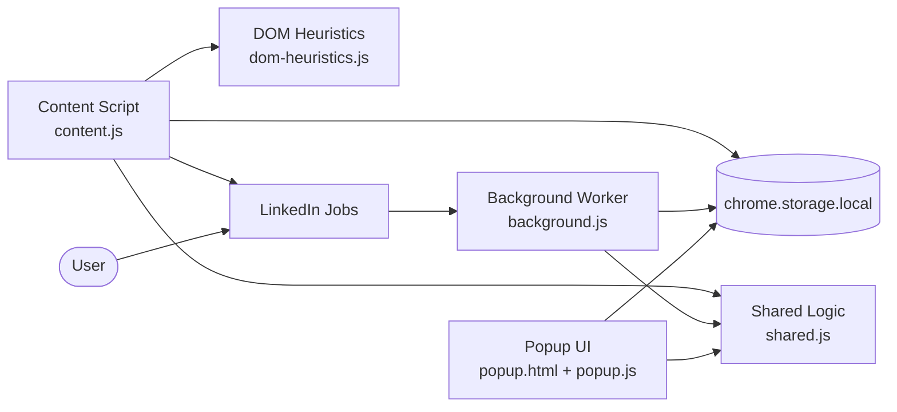

<h1 align="center">Job Hunt Visualizer</h1>

<p align="center">
  A privacy-first Chrome extension for LinkedIn Jobs that highlights the keywords you care about
  and passively dims job cards already marked by LinkedIn as Viewed, Saved, or Applied.
</p>

<p align="center">
  
  
  
  
  
</p>

<p align="center">
  <a href="#overview">Overview</a> ·
  <a href="#features">Features</a> ·
  <a href="#installation">Installation</a> ·
  <a href="#permissions">Permissions</a> ·
  <a href="#privacy">Privacy</a> ·
  <a href="#publishing-resources">Publishing Resources</a>
</p>

---

## Overview

Job Hunt Visualizer has one narrow purpose: make LinkedIn Jobs easier to scan without sending any browsing data to a backend.

It does two things:

1. Highlights saved keywords inside job details.
2. Passively dims job cards LinkedIn already labels as Viewed, Saved, or Applied.

All settings stay local in the browser through `chrome.storage.local`.

## Features

- Highlight custom keywords in LinkedIn job details.
- Save keywords from selected text through the context menu.
- Assign a color to each keyword with an inline palette.
- Search, sort, and export the keyword library.
- Dim Viewed, Saved, and Applied jobs independently.
- Navigate between matches with previous and next controls.
- Switch between Auto, Light, and Dark popup themes.
- Handle LinkedIn SPA route changes and multiple results-list layouts.
- Avoid page-wide DOM mutation strategies that can cause LinkedIn instability.

## Installation

### Local setup

```bash
git clone https://github.com/MadhushanAndawaththa/Job_Search.git
cd Job_Search
npm install
npm test
```

### Load the extension in Chrome

1. Open `chrome://extensions`.
2. Enable Developer mode.
3. Click Load unpacked.
4. Select this repository folder.
5. Open `https://www.linkedin.com/jobs/` and use the popup or context menu.

## Permissions

The extension keeps its permission surface intentionally small.

| Permission | Why it is needed |
|---|---|
| `contextMenus` | Adds the selection-based “Add to Highlighter” action on LinkedIn pages. |
| `storage` | Stores keywords, colors, theme preference, and dim-state settings locally. |
| `tabs` | Lets the popup identify the active LinkedIn tab and ask the content script for status and match navigation. |
| `https://www.linkedin.com/*` host access | Restricts content-script execution to LinkedIn pages only. |

## Privacy

Job Hunt Visualizer is designed to be publishable under a conservative, local-only privacy model.

- No telemetry
- No analytics
- No external API calls
- No remote code
- No user accounts
- No cloud sync
- No sale or sharing of personal data

The extension reads LinkedIn page content only to highlight your saved terms and detect LinkedIn’s own Viewed, Saved, and Applied labels already rendered on the page. That processing stays local to the browser.

For a store-ready policy document, see [docs/privacy-policy.html](docs/privacy-policy.html).

## Architecture



## Testing

Automated coverage currently includes 15 passing tests across shared helpers and DOM-fixture heuristics.

```bash
npm test
```

Current coverage includes:

- keyword normalization and deduplication
- hex color validation and contrast selection
- keyword insert, remove, and recolor flows
- literal regex generation for special-character terms
- LinkedIn job ID extraction
- settings sanitization
- scenario-based results-list detection heuristics
- visual wrapper promotion for LinkedIn card variants

## Publishing Resources

The public product site is at **[madhushanandawaththa.github.io/Job_Search](https://madhushanandawaththa.github.io/Job_Search/)**
(served from the `docs/` folder via GitHub Pages).

This repo also includes the assets and reference material needed for store preparation:

- [docs/index.html](docs/index.html): product landing page
- [docs/privacy-policy.html](docs/privacy-policy.html): privacy policy — [live link](https://madhushanandawaththa.github.io/Job_Search/privacy-policy.html)
- [docs/support.html](docs/support.html): support page — [live link](https://madhushanandawaththa.github.io/Job_Search/support.html)
- [docs/chrome-web-store-submission.txt](docs/chrome-web-store-submission.txt): listing copy, permission justifications, and publish checklist
- `assets/icons/`: manifest and store icon files (16 / 32 / 48 / 128 px)
- `assets/store/`: branded promo tiles and listing graphics
- `tools/generate-assets.ps1`: repeatable PowerShell script to regenerate all store graphics

## Project Structure

```text
Job_Search/
├── assets/
│   ├── icons/                  # Manifest and store icons
│   └── store/                  # Promo tiles and listing graphics
├── background.js              # Context menu capture and local keyword storage
├── content.js                 # LinkedIn DOM integration and highlight/dim orchestration
├── dom-heuristics.js          # Scenario-safe list/card detection helpers
├── docs/
│   ├── index.html             # Homepage-style landing page
│   ├── privacy-policy.html    # Privacy policy page
│   ├── support.html           # Support page
│   └── chrome-web-store-submission.txt
├── manifest.json              # Chrome extension manifest
├── popup.html                 # Popup UI markup and styling
├── popup.js                   # Popup logic and active-tab diagnostics
├── shared.js                  # Shared logic used across runtime surfaces
├── styles.css                 # Highlight and dim styling injected into LinkedIn
├── tests/
│   ├── dom-heuristics.test.js
│   ├── fixtures/
│   └── shared.test.js
├── theme-init.js              # Early theme bootstrap for no-flash popup rendering
├── tools/
│   └── generate-assets.ps1    # Rebuilds icons and store graphics
├── package.json
└── .gitignore
```

## License

This project is released under the **MIT License + Commons Clause**.

You are free to use, study, modify, and share the code for personal or educational purposes.
Selling, charging for access to, or building a paid product from this code is not permitted.

See [LICENSE](LICENSE) for the full text.

---

## Disclaimer

This project is an independent utility and is not affiliated with or endorsed by LinkedIn.

LinkedIn may change its markup or platform policies at any time, so selector maintenance and careful release review remain necessary.

## Version History

| Version | Summary |
|---|---|
| 1.2.2 | Redesigned GitHub Pages product/privacy/support site, MIT + Commons Clause license, shared docs stylesheet |
| 1.2.1 | Publish-prep metadata, icons, static policy/support pages, scenario 5 heuristics, and DOM fixture tests |
| 1.2.0 | Color palette swatches, keyword export and sort, and multi-list root coverage |
| 1.1.0 | Theme support, Saved and Applied dimming, and SPA-aware observers |
| 1.0.0 | Initial release: keyword highlighting and Viewed-state dimming |